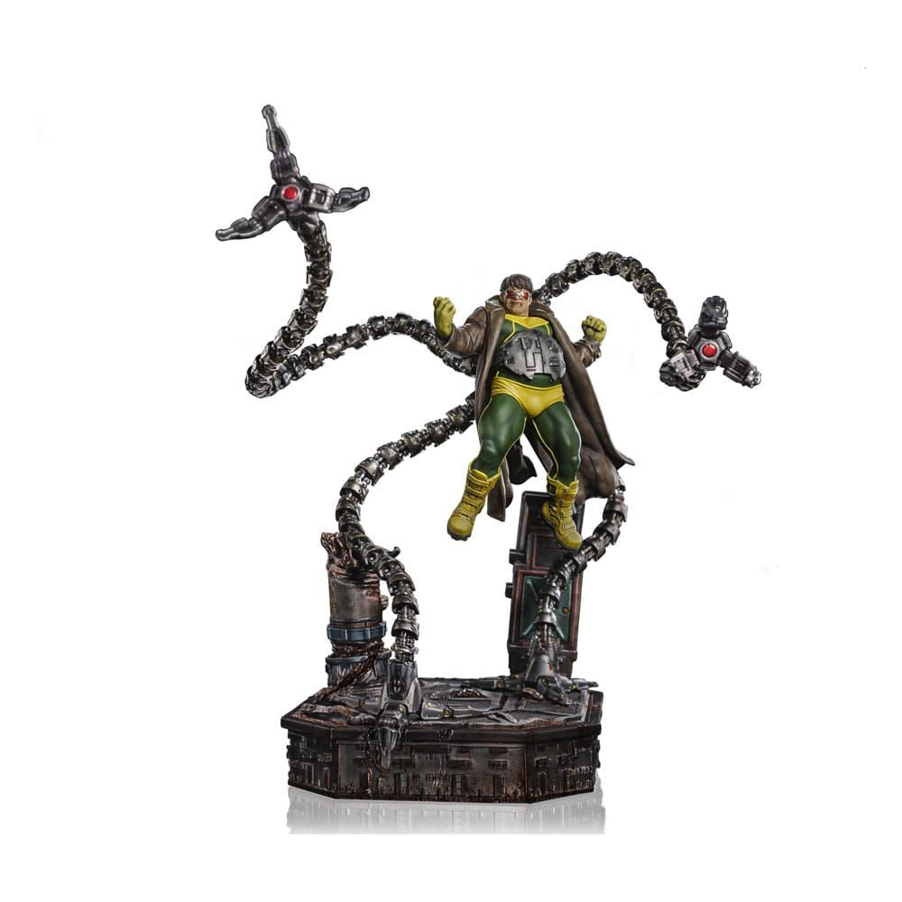

# The Octopus and the Pup: An Epic Battle Saga

In the annals of unlikely confrontations, few could have predicted the day when Adventure Bay would face its greatest threat—not from Mayor Humdinger's schemes or natural disasters, but from one of Marvel's most formidable villains. This epic tale chronicles the extraordinary clash between the brilliant and megalomaniacal Doctor Octopus and the brave police pup Chase, proving that heroism comes in all sizes.

Chase, the German Shepherd police pup from PAW Patrol, in his blue uniform.

## Chapter 1: The Arrival of Chaos

The morning began like any other in Adventure Bay, with Chase conducting his routine patrol around the peaceful coastal community [^1]. The seven-year-old German Shepherd had just finished directing traffic near the town square when an otherworldly portal tore open the sky above the harbor [^2]. From this dimensional rift emerged Dr. Otto Octavius, better known as Doctor Octopus, his four massive mechanical tentacles carrying him through the air with deadly grace [^3][^4].

Doctor Octopus's arrival was no accident—a failed experiment with interdimensional technology had transported the brilliant nuclear physicist from his ongoing battle with Spider-Man to this seemingly defenseless seaside town [^5]. Each of his titanium-steel tentacles, capable of lifting eight tons and moving at ninety feet per second, immediately began wreaking havoc on the peaceful community [^4][^6].

A detailed figurine of Doctor Octopus with mechanical tentacles.

The villain's megalonomaniacal nature quickly surfaced as he surveyed his new domain [^3]. "Finally, a place where my superior intellect can reshape society without the interference of that web-slinging pest," Doc Ock declared, his tentacles smashing through the marina's wooden piers with terrifying ease [^4].

## Chapter 2: Chase is on the Case

When Ryder's emergency alert system detected the unprecedented threat, Chase immediately responded with his characteristic determination [^7]. "PAW Patrol ready for action, Ryder, sir!" the police pup announced, though even his trained instincts couldn't have prepared him for the sight of the eight-limbed menace terrorizing his beloved community [^8].

Despite being vastly outmatched in size and strength, Chase's natural leadership qualities and "by the book" approach kicked into high gear [^2]. He quickly analyzed the situation: Doctor Octopus's mechanical appendages were controlled by a sophisticated neural interface, making him incredibly dangerous but potentially vulnerable to strategic thinking [^9].

Chase's police truck roared to life as he sped toward the harbor, his spy equipment transforming the vehicle into its advanced reconnaissance mode [^8]. The pup's excellent sense of smell and tracking abilities—honed through countless rescue missions—would prove crucial in this unprecedented confrontation [^1][^10].

## Chapter 3: David Versus Goliath

The first direct confrontation occurred at Adventure Bay's nuclear research facility, where Doctor Octopus had begun constructing a new fusion reactor using his vast knowledge of nuclear physics [^4]. The villain's plan was ambitious: create a new power source that would make him the undisputed ruler of this dimension [^3].

Chase arrived just as Doc Ock's tentacles were tearing through the facility's security systems. "Halt! These paws uphold the laws!" the brave pup declared through his megaphone, though his voice seemed impossibly small against the mechanical whirring of the villain's appendages [^8].

Spider-Man battles Doctor Octopus in a comic book scene.

Doctor Octopus paused, genuinely perplexed by the sight of a small dog challenging him. "A canine law enforcement officer? How quaint," he sneered, one tentacle casually swatting at Chase's position [^3]. But the agile police pup was ready—his training in agility and quick reflexes allowed him to dodge the massive mechanical arm by mere inches [^10].

## Chapter 4: The Power of Strategy

What Chase lacked in brute strength, he compensated for with tactical brilliance and an intimate knowledge of his environment [^1]. The police pup had spent years protecting Adventure Bay and knew every street, building, and potential advantage the town offered [^2].

Using his tennis ball cannon—normally employed for crowd control—Chase began targeting the joints and sensors of Doctor Octopus's mechanical arms [^8]. While the small projectiles couldn't damage the titanium construction, they created crucial distractions that disrupted the villain's concentration [^6].

The battle moved through Adventure Bay's streets, with Chase using his superior speed and maneuverability to stay ahead of Doc Ock's devastating tentacle strikes [^1]. The police pup's spy drone provided aerial reconnaissance, allowing him to anticipate the villain's movements and coordinate his defensive strategies [^11].

## Chapter 5: Unlikely Reinforcements

As news of the battle spread, the entire PAW Patrol mobilized to support their police pup leader [^7]. Marshall arrived with his fire truck, using high-pressure water hoses to create steam clouds that obscured Doctor Octopus's vision [^7]. Skye's helicopter provided air support, while Rubble's construction equipment created barriers and obstacles to slow the villain's advance [^7].

Even the citizens of Adventure Bay joined the effort—Cap'n Turbot used his marine biology knowledge to suggest that the villain's tentacles might be vulnerable to electromagnetic interference, while Mayor Goodway coordinated evacuation efforts [^7].

Doctor Octopus found himself increasingly frustrated by the coordinated resistance. His superior intellect had expected easy domination, but the combined efforts of the PAW Patrol and Adventure Bay's community presented challenges he hadn't anticipated [^3][^4].

## Chapter 6: The Turning Point

The decisive moment came when Chase realized that Doctor Octopus's greatest strength—his mechanical tentacles—could also be his weakness [^6]. The police pup had observed that the villain's neural control required intense concentration, and any significant disruption could cause temporary system failures [^9].

Working with Rocky's recycling expertise, Chase devised a plan using Adventure Bay's industrial electromagnets at the salvage yard [^7]. If they could generate a powerful enough electromagnetic pulse, it might interfere with the delicate neural-mechanical interface controlling Doc Ock's tentacles [^4].

The plan required precise timing and incredible bravery. Chase would need to lure Doctor Octopus into the salvage yard while maintaining enough distance to avoid the tentacles' devastating reach [^10]. Using his natural herding instincts—enhanced by his German Shepherd genetics—the police pup began executing the most dangerous mission of his career [^1].

## Chapter 7: The Final Confrontation

The climactic battle unfolded in Adventure Bay's industrial district, where massive electromagnets and metal debris created a treacherous battlefield [^6]. Doctor Octopus's tentacles moved with predatory grace, each strike capable of crushing concrete and steel, while Chase darted between obstacles with the agility that had made him the PAW Patrol's most reliable member [^4][^1].

"You cannot escape science, little pup!" Doc Ock roared, his tentacles creating a fifty-mile-per-hour windstorm as they spun in coordinated patterns [^6]. But Chase's determination never wavered—every rescue mission had taught him that protecting others required courage beyond his own limitations [^10].

At the crucial moment, Chase activated the electromagnetic pulse while simultaneously deploying his net launcher [^8]. The powerful magnetic field disrupted Doctor Octopus's neural control just long enough for the specially designed containment net to entangle the mechanical appendages [^9].

## Chapter 8: Victory and Redemption

With his tentacles temporarily disabled, Doctor Octopus found himself vulnerable for the first time since arriving in Adventure Bay [^4]. But rather than seek revenge, Chase demonstrated the compassion that defined the PAW Patrol's mission [^7]. The police pup recognized that Otto Octavius was as much a victim of his accident as a perpetrator of villainy [^12].

Working with Ryder's technical expertise, the team managed to create a modified version of the portal technology that had brought Doc Ock to their dimension [^5]. The solution offered the villain a choice: return to his own world to face justice, or remain in Adventure Bay under supervised rehabilitation [^3].

Doctor Octopus, impressed despite himself by the small dog's tactical brilliance and moral courage, chose to return to his own dimension [^4]. "You have shown me something I had forgotten, young pup," he admitted. "That true strength comes not from power, but from the willingness to protect others" [^12].

## Epilogue: Lessons Learned

As the dimensional portal closed and Adventure Bay returned to its peaceful existence, Chase reflected on the extraordinary adventure [^1]. The confrontation with Doctor Octopus had tested every skill he possessed—from his police training to his natural leadership abilities—but more importantly, it had reinforced the values that made the PAW Patrol special [^7].

The battle became legend in Adventure Bay, proving that heroism isn't measured by size or strength, but by the courage to stand up for what's right [^2][^10]. Chase's victory over one of Marvel's most formidable villains demonstrated that with determination, strategy, and the support of friends, even the smallest hero can overcome the greatest challenges [^1].

In the years that followed, whenever young pups in Adventure Bay doubted their own abilities, their parents would tell them the story of Chase and the Octopus—a reminder that every individual, no matter how small, has the potential for greatness [^7]. And somewhere in another dimension, a reformed Otto Octavius occasionally looked up at the stars and remembered the lesson learned from a brave German Shepherd police pup: that true power comes from protecting others, not dominating them [^3][^12].

The saga stands as a testament to the timeless truth that good will always triumph over evil, especially when that good comes in the form of a determined pup who knows that these paws uphold the laws [^8][^1].

⁂

[^1]: https://nickelodeonuniverse.com/character/chase/

[^2]: https://www.pawpatrol.com/characters/chase

[^3]: https://en.wikipedia.org/wiki/Doctor_Octopus

[^4]: https://www.marvel.com/characters/doctor-octopus-otto-octavius/in-comics

[^5]: https://en.wikipedia.org/wiki/Otto_Octavius_(film_character)

[^6]: https://www.writeups.org/doctor-octopus-spider-man-marvel-comics/

[^7]: https://en.wikipedia.org/wiki/Paw_Patrol

[^8]: http://www.wolfemountain.com/uploads/3/8/1/4/38141613/paw.patrol.chase.pdf

[^9]: https://www.youtube.com/watch?v=JkuxhBW2Fb0

[^10]: https://www.youtube.com/watch?v=SimRNrsnYjc

[^11]: https://www.youtube.com/watch?v=5SSBJZaoGHQ

[^12]: https://www.youtube.com/watch?v=aJZloBaVSRk

[^13]: https://www.youtube.com/watch?v=ArCwv-tqPIQ

[^14]: https://www.comicbookherald.com/doctor-octopus-otto-octavius-reading-order/

[^15]: https://www.deviantart.com/nobodyherewhatsoever/journal/What-your-favorite-PAW-Patrol-pup-says-about-you-869374744

[^16]: https://marvel.fandom.com/wiki/Otto_Octavius_(Earth-616)

[^17]: https://marvelcinematicuniverse.fandom.com/wiki/Doctor_Octopus

[^18]: https://www.pawpatrol.com/kids/filtered-results?character=chase\&path=kids

[^19]: https://pawpatrol.fandom.com/wiki/Chase

[^20]: https://hero.fandom.com/wiki/Chase_(PAW_Patrol)

